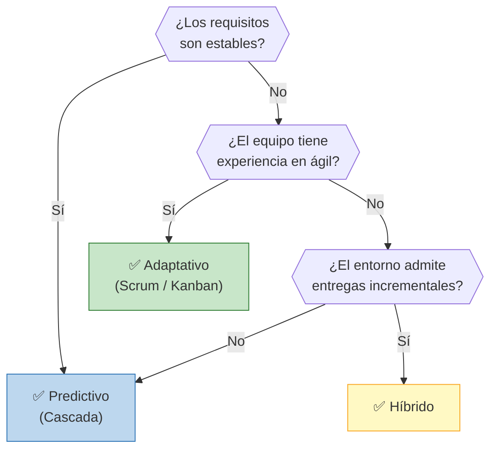
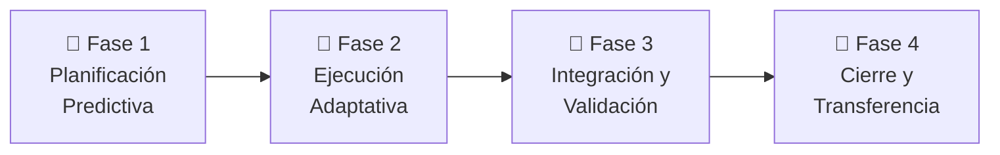

# 🔄 Ciclo de Vida del Proyecto

## Enfoque seleccionado

> Híbrido

## Justificación de la elección

> El proyecto BioNest adopta un enfoque híbrido porque combina dos perfiles de incertidumbre radicalmente distintos en una misma iniciativa.
>
> En la **Fase 1**, los requisitos son estables y predecibles: el alcance normativo y bioético debe estar completamente cerrado antes de comprometer recursos de laboratorio. No hay margen para iterar sobre el expediente del Comité de Ética ni sobre el Plan de Gestión. Esta estabilidad de requisitos, sumada a la necesidad de una línea base formal exigida por el sponsor (NestBiotech) y por los organismos regulatorios (CICUAL, IRAM/IEC), justifica una gestión **predictiva (cascada)** para esta fase.
>
> En la **Fase 2**, la incertidumbre cambia de naturaleza: pasa de ser regulatoria a ser **técnica y experimental**. Los tiempos de bioimpresión, el comportamiento de los hidrogeles bajo presión, la calibración empírica de los módulos de oxigenación y diálisis, y la integración electrónica con el Dashboard son actividades que no pueden planificarse con precisión porque dependen de resultados de laboratorio iterativos. Un plan predictivo rígido en esta etapa generaría retrabajo costoso. Por eso se adopta **Kanban** como marco adaptativo: permite flujo continuo sin sprints fijos, visualización del estado de cada subsistema en tiempo real, limitación del trabajo en progreso (WIP) y reincorporación ágil de tareas cuando un material o parámetro no supera su prueba unitaria.
>
> Finalmente, el equipo es pequeño (8 personas), multidisciplinario y sin experiencia previa homogénea en marcos ágiles formales como Scrum, lo que refuerza la elección de Kanban por su baja curva de adopción y su compatibilidad con el trabajo de laboratorio experimental.

## Árbol de decisión

> **Decisión del grupo:** Los requisitos normativos y bioéticos de la Fase 1 son estables → rama *Sí*. Sin embargo, una vez aprobado el Stage-Gate 1, la construcción experimental del prototipo enfrenta alta incertidumbre técnica → los requisitos de la Fase 2 *no* son totalmente estables. El equipo no posee experiencia consolidada en marcos ágiles formales (Scrum), pero el entorno de laboratorio **sí admite entregas incrementales** por subsistema (receptáculo → circuitos → electrónica → integración). La decisión sigue la rama: **No estables → Sin experiencia ágil → Entorno admite incrementales → ✅ Híbrido**.

## Fases del proyecto

| Fase | Nombre | Objetivo | Criterio de salida |
|------|--------|----------|--------------------|
| 1 | Planificación Predictiva | Definir el alcance técnico completo, establecer la línea base del proyecto, elaborar el expediente bioético y obtener las aprobaciones normativas (CICUAL, IRAM/IEC) necesarias para habilitar la ejecución. | **Stage-Gate 1:** aprobación del Plan de Gestión por el sponsor + aprobación ética institucional (CICUAL) + validación técnica de requisitos de todos los subsistemas. |
| 2 | Ejecución Adaptativa (Kanban) | Desarrollar, fabricar y validar unitariamente cada subsistema del prototipo (receptáculo, circuitos de soporte vital, electrónica y control) mediante flujo continuo iterativo, con criterios de avance definidos por Stage-Gates técnicos inter-subsistema (S1–S5). | **Stage-Gates S1 a S5:** cada subsistema supera su prueba unitaria de aceptación antes de ingresar a la fase de integración. |
| 3 | Integración y Validación Final | Ensamblar e integrar todos los subsistemas validados, calibrar el sistema completo y ejecutar el protocolo de pruebas integradas (hidráulicas, térmicas y prueba continua de 24 hs) con registro formal de resultados. | **Stage-Gate S6:** operación conjunta de todos los subsistemas durante la prueba integrada, con variables dentro de rangos fisiológicos aceptables y documentación técnica completa aprobada. |
| 4 | Cierre y Transferencia | Elaborar la documentación técnica final (planos As-Built, fichas técnicas, log de decisiones, manual de usuario), preparar los materiales institucionales de licenciamiento y ejecutar la presentación formal del prototipo al cliente (Institución de Conservación). | Presentación al cliente ejecutada + documentación As-Built aprobada + reunión de cierre formal completada. |

---

*Cátedra Gestión de Proyectos · FIUNER · 2026*
