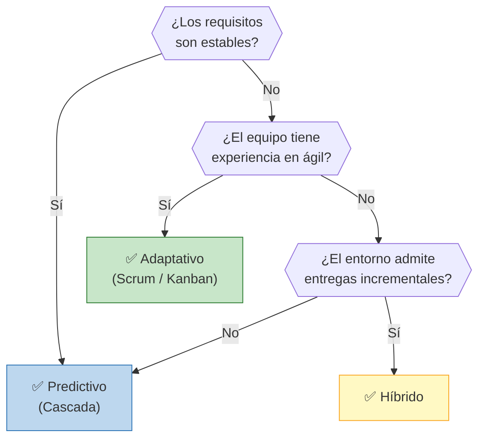
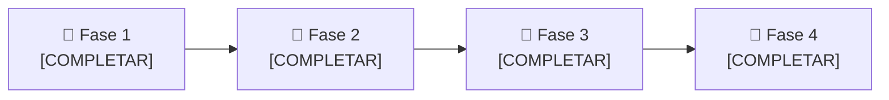

# 🔄 Ciclo de Vida del Proyecto

## Enfoque seleccionado

> **[COMPLETAR: Predictivo / Adaptativo / Híbrido]**

## Justificación de la elección

> [COMPLETAR: explicar por qué este enfoque es el más adecuado para el proyecto, considerando características como: complejidad, claridad de requisitos, tamaño del equipo, tolerancia al cambio, experiencia del equipo, etc.]

## Árbol de decisión

> **Decisión del grupo:** [COMPLETAR: indicar cuál rama del árbol aplica a su caso y por qué]

## Fases del proyecto

| Fase | Nombre | Objetivo | Criterio de salida |
|------|--------|----------|-------------------|
| 1 | [COMPLETAR] | [COMPLETAR] | [COMPLETAR] |
| 2 | [COMPLETAR] | [COMPLETAR] | [COMPLETAR] |
| 3 | [COMPLETAR] | [COMPLETAR] | [COMPLETAR] |
| 4 | [COMPLETAR] | [COMPLETAR] | [COMPLETAR] |

---

*Cátedra Gestión de Proyectos · FIUNER · 2026*
