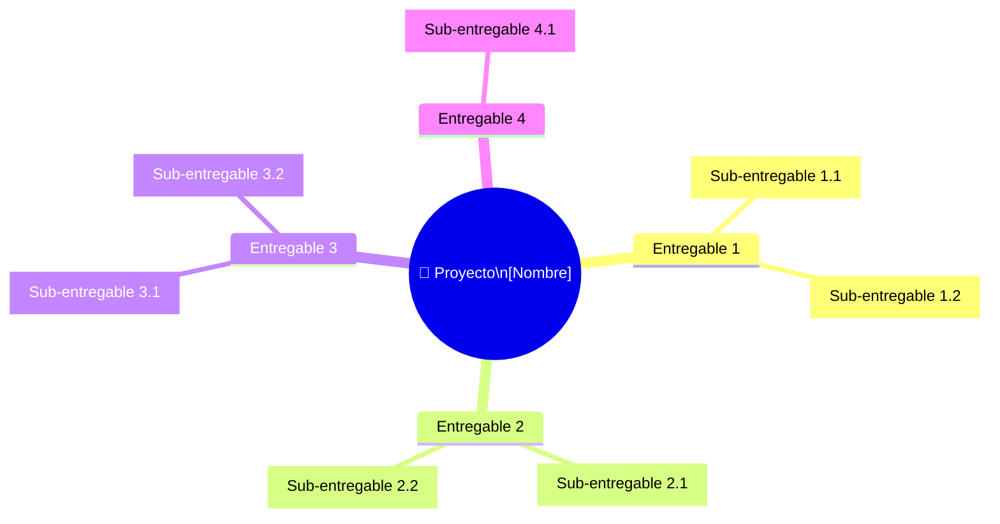

# 📦 Entregables Principales del Proyecto

## Lista de entregables

## Detalle de entregables

| # | Entregable | Descripción | Responsable | Criterio de aceptación |
|---|-----------|-------------|------------|------------------------|
| 1 | [COMPLETAR] | [COMPLETAR] | [COMPLETAR] | [COMPLETAR] |
| 2 | [COMPLETAR] | [COMPLETAR] | [COMPLETAR] | [COMPLETAR] |
| 3 | [COMPLETAR] | [COMPLETAR] | [COMPLETAR] | [COMPLETAR] |
| 4 | [COMPLETAR] | [COMPLETAR] | [COMPLETAR] | [COMPLETAR] |

## Exclusiones del alcance

> [COMPLETAR: indicar explícitamente qué NO está incluido en el proyecto para evitar ambigüedades]

- [COMPLETAR: exclusión 1]
- [COMPLETAR: exclusión 2]

---

*Cátedra Gestión de Proyectos · FIUNER · 2026*
