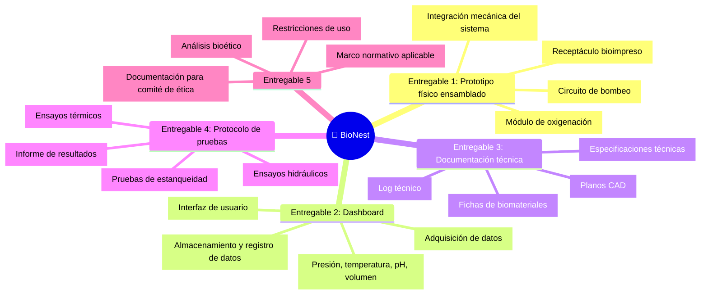

# 📦 Entregables Principales del Proyecto

## Lista de entregables

## Detalle de entregables

| # | Entregable | Descripción | Responsable | Criterio de aceptación |
|---|-----------|-------------|------------|------------------------|
| 1 | [COMPLETAR] | [COMPLETAR] | [COMPLETAR] | [COMPLETAR] |
| 2 | [COMPLETAR] | [COMPLETAR] | [COMPLETAR] | [COMPLETAR] |
| 3 | [COMPLETAR] | [COMPLETAR] | [COMPLETAR] | [COMPLETAR] |
| 4 | [COMPLETAR] | [COMPLETAR] | [COMPLETAR] | [COMPLETAR] |

## Exclusiones del alcance

> A continuación se listan explícitamente los elementos que quedan fuera del alcance del proyecto, con el objetivo de prevenir desviaciones, gestionar expectativas de los stakeholders y evitar ambigüedades durante la ejecución:

- Obtención de material biológico vivo: la generación, adquisición o manipulación de cigotos, gametos, embriones o cualquier tejido biológico vivo queda completamente fuera del alcance. Estos insumos, en caso de ser requeridos en fases futuras, serán provistos por terceros especializados.
- Modificación o edición genética: el proyecto no contempla ninguna actividad vinculada a manipulación genética, edición genómica (CRISPR u otras tecnologías) ni mejoramiento de especies.
- Desarrollo de fórmulas biológicas (nutrientes u hormonas): el sistema de inyección será validado únicamente a nivel mecánico y volumétrico. Los compuestos biológicos reales requeridos para el desarrollo de un organismo vivo serán definidos y provistos por laboratorios externos especializados.
- Producción en escala o fabricación en serie: el proyecto se limita al desarrollo de un único prototipo funcional como prueba de concepto. No se contemplan actividades de industrialización, manufactura repetitiva ni escalado del sistema.
- Gestación humana: el sistema excluye de forma explícita e irrevocable su uso para la gestación humana desde etapa embrionaria o in vitro, por razones bioéticas, morales y regulatorias. Su eventual derivación clínica futura en humanos se limitará estrictamente al soporte vital transitorio de neonatos prematuros extremos, y queda fuera del alcance de este proyecto.
- Integración con infraestructuras veterinarias externas: no se prevé la conexión ni compatibilización del sistema con equipamiento, bases de datos ni protocolos operativos de instituciones veterinarias o zoológicas externas.
- Protocolos de bioseguridad de nivel industrial: las pruebas se realizarán bajo condiciones estándar de laboratorio. No se desarrollarán instalaciones, cámaras de contención ni protocolos de bioseguridad de nivel BSL-3 o superior.
- Adaptación a otras especies: el diseño, calibración y validación del sistema se limita a los parámetros fisiológicos del rinoceronte blanco del norte (Ceratotherium simum cottoni). No se contempla la adaptación del sistema a otras especies animales dentro del presente proyecto.

---

*Cátedra Gestión de Proyectos · FIUNER · 2026*
