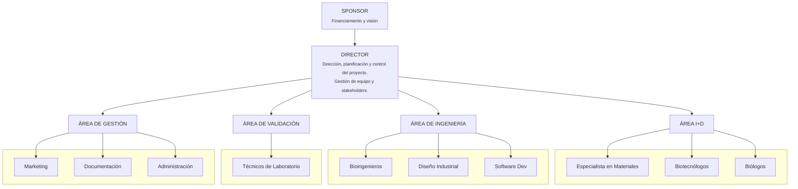

# 🏢 Organización del Proyecto

## Usuarios e interesados (Stakeholders)

| Nombre / Rol | Área | Interés en el proyecto | Influencia |
|--------------|------|------------------------|-----------|
| **NestBiotech (Sponsor)** | Financiamiento / Desarrollo | Obtener un sistema licenciable y validado para el mercado bajo modelo de licenciamiento tecnológico. | Alta |
| **Institución de Conservación (Cliente)** | Conservación animal | Acceder a soluciones reproductivas tecnológicas para especies en peligro crítico de extinción. | Alta |
| **Director del Proyecto** | Gestión | Entrega en tiempo, costo y cumplimiento de hitos (Stage-Gates). | Alta |
| **CICUAL** | Regulatorio / Bioética | Evaluación y aprobación del expediente bioético para habilitación de la ejecución (Stage-Gate 1). | Media |
| **Organismos Regulatorios (IRAM/IEC)** | Regulatorio / Seguridad | Certificación de seguridad eléctrica del sistema electrónico previo al Stage-Gate 1. | Media |
| **Proveedores** | Cadena de suministro | Acuerdos comerciales y provisión de biomateriales, componentes electrónicos e insumos de laboratorio según especificaciones técnicas. | Media |

## Áreas involucradas

- **Investigación y Desarrollo (I+D):** responsable del diseño conceptual del sistema, la selección de biomateriales, la definición de parámetros fisiológicos objetivo (lagomorfos) y la revisión bibliográfica de antecedentes técnicos (Biobag, EVE, Weizmann). Es el área central del proyecto.
- **Ingeniería:** a cargo del diseño CAD de los subsistemas, la bioimpresión del receptáculo uterino, la construcción del circuito de soporte vital (bombeo, oxigenación, diálisis) y la integración electrónica del sistema de sensores con el Dashboard. Ejecuta la fase adaptativa del ciclo de vida.
- **Validación Experimental:** responsable de la ejecución de los ensayos de laboratorio definidos en el protocolo de pruebas (hidráulicos, térmicos y de estanqueidad). Verifica el cumplimiento de los criterios de aceptación de cada Stage-Gate técnico (S1–S6).
- **Documentación Técnica y Bioética:** elabora y mantiene actualizada toda la documentación del proyecto: diagramas, planos, fichas técnicas, registros de pruebas, actas de Stage-Gates y el expediente requerido por CICUAL. Garantiza la trazabilidad del proceso conforme a PMBOK.
- **Marketing y Comunicación:** responsable de la elaboración de materiales institucionales para la presentación del sistema ante la Institución de Conservación (cliente) y del soporte al modelo de licenciamiento tecnológico de NestBiotech.

## Equipo del proyecto

| Integrante | Rol en el proyecto | Responsabilidad principal |
|------------|--------------------|--------------------------|
| **[Nombre]** | Director / Líder de Proyecto | Planificación y control general del proyecto. Gestión del ciclo de vida híbrido, conducción de Stage-Gates, comunicación con el sponsor y el cliente, gestión de riesgos y toma de decisiones de escalamiento. |
| **[Nombre]** | Bioingeniero — Electrónica | Diseño e integración del sistema electrónico de sensores. Desarrollo del Dashboard de monitoreo. Validación de la lectura simultánea de variables críticas (presión, temperatura, pH, volumen). |
| **[Nombre]** | Especialista en Materiales | Selección y caracterización de biomateriales e hidrogeles para el receptáculo bioimpreso. Validación de propiedades mecánicas e hidráulicas. Soporte técnico en pruebas de estanqueidad. |
| **[Nombre]** | Biotecnólogo / Biólogo | Definición de parámetros fisiológicos de referencia para lagomorfos y escalabilidad hacia el rinoceronte blanco del norte. Supervisión técnica de los módulos de oxigenación y diálisis. Participación en la elaboración del expediente bioético. |
| **[Nombre]** | Técnico de Laboratorio | Ejecución de ensayos experimentales (hidráulicos, térmicos y de estanqueidad). Registro de datos de laboratorio. Operación del prototipo durante las pruebas de validación. |
| **[Nombre]** | Desarrollador de Software | Desarrollo del Dashboard de monitoreo en tiempo real y del sistema de registro y almacenamiento de datos experimentales. Integración con la matriz de sensores. |
| **[Nombre]** | Lic. en Diseño Industrial | Diseño funcional y ergonómico del receptáculo y el habitáculo. Modelado CAD del sistema. Coordinación con Ingeniería para la bioimpresión y el ensamblaje del prototipo. |
| **[Nombre]** | Responsable de Marketing | Elaboración de materiales de presentación institucional del sistema. Soporte en la comunicación con la Institución de Conservación y en el posicionamiento del modelo de licenciamiento. |

## Estructura del equipo

---

*Cátedra Gestión de Proyectos · FIUNER · 2026*
