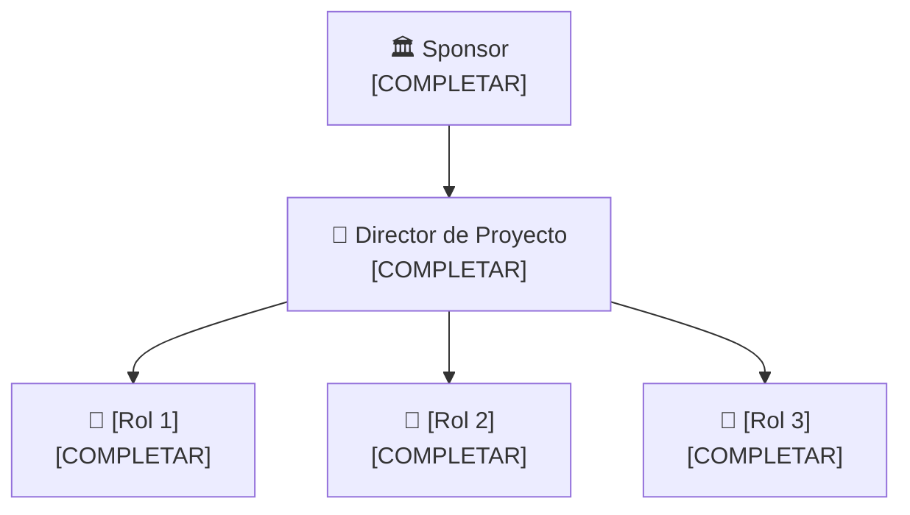

# 🏢 Organización del Proyecto

## Usuarios e interesados (Stakeholders)

| Nombre / Rol | Área | Interés en el proyecto | Influencia |
|--------------|------|------------------------|-----------|
| [COMPLETAR] | [COMPLETAR] | [COMPLETAR] | Alta / Media / Baja |
| [COMPLETAR] | [COMPLETAR] | [COMPLETAR] | Alta / Media / Baja |
| [COMPLETAR] | [COMPLETAR] | [COMPLETAR] | Alta / Media / Baja |

## Áreas involucradas

- [COMPLETAR: área 1 y su rol en el proyecto]
- [COMPLETAR: área 2 y su rol en el proyecto]
- [COMPLETAR: área 3 y su rol en el proyecto]

## Equipo del proyecto

| Integrante | Rol en el proyecto | Responsabilidad principal |
|------------|--------------------|--------------------------|
| [COMPLETAR] | Director / Líder de Proyecto | [COMPLETAR] |
| [COMPLETAR] | [COMPLETAR] | [COMPLETAR] |
| [COMPLETAR] | [COMPLETAR] | [COMPLETAR] |

## Estructura del equipo

---

*Cátedra Gestión de Proyectos · FIUNER · 2026*
