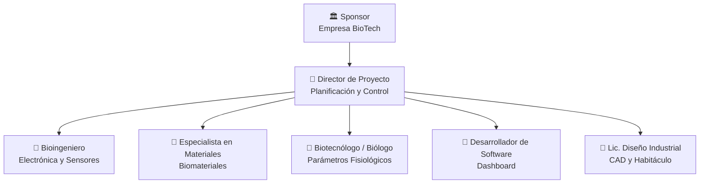

# 🏢 Organización del Proyecto

## Usuarios e interesados (Stakeholders)

| Nombre / Rol | Área | Interés en el proyecto | Influencia |
|--------------|------|------------------------|-----------|
| **Empresa BioTech (Sponsor)** | Financiamiento / Desarrollo | Obtener un sistema licenciable y validado para el mercado. | Alta |
| **Institución de Conservación (Cliente)** | Conservación animal | Soluciones reproductivas para especies en peligro crítico. | Alta |
| **Director del Proyecto** | Gestión | Entrega en tiempo, costo y cumplimiento de hitos (Stage-Gates). | Alta |
| **Comité de Ética Institucional** | Regulatorio / Bioética | Evaluación y aprobación del expediente bioético. | Alta |
| **Proveedores de Biomateriales** | Cadena de suministro | Acuerdos comerciales y especificaciones técnicas claras de insumos. | Media |

## Áreas involucradas

- **Investigación y Desarrollo (I+D):** Responsable del diseño conceptual, selección de materiales y definición de parámetros fisiológicos.
- **Ingeniería:** A cargo del diseño CAD, bioimpresión, construcción del circuito de soporte vital e integración electrónica.
- **Validación Experimental:** Ejecuta ensayos de laboratorio (pruebas hidráulicas, térmicas y de estanqueidad) para verificar criterios de aceptación.
- **Documentación Técnica y Bioética:** Elabora los planos, registros de pruebas y el expediente para el comité de ética.

## Equipo del proyecto

| Integrante | Rol en el proyecto | Responsabilidad principal |
|------------|--------------------|--------------------------|
| **[Nombre]** | Director / Líder de Proyecto | Planificación, control general y coordinación con ingeniería para el ensamblaje. |
| **[Nombre]** | Especialista en Materiales | Selección de biomateriales y validación de sus propiedades mecánicas e hidráulicas. |
| **[Nombre]** | Bioingeniero (Electrónica) | Desarrollo de sensores, placas PCB e integración del sistema de monitoreo. |
| **[Nombre]** | Biotecnólogo / Biólogo | Definición de parámetros fisiológicos y supervisión de módulos de hematosis y diálisis. |
| **[Nombre]** | Desarrollador de Software | Desarrollo del Dashboard de monitoreo en tiempo real y registro de datos. |

## Estructura del equipo

---

*Cátedra Gestión de Proyectos · FIUNER · 2026*
