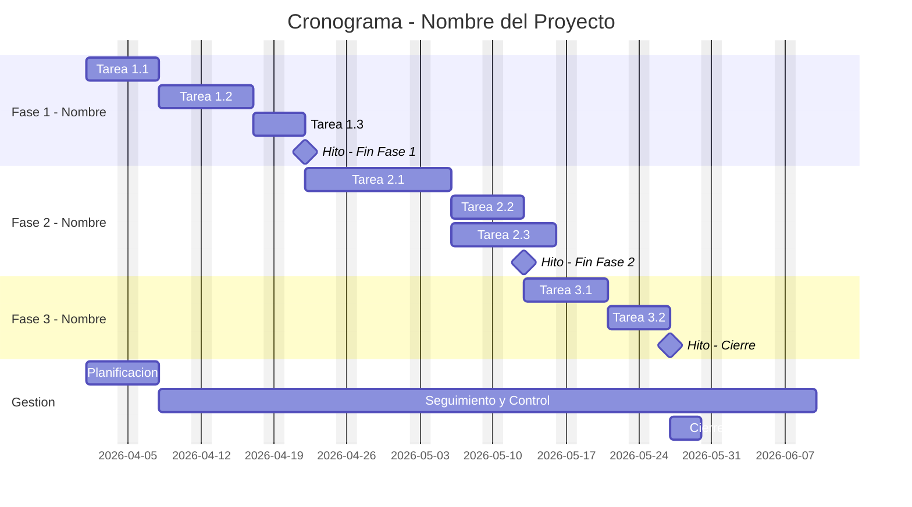

# 📅 Cronograma del Proyecto

## Diagrama de Gantt

## Tabla de tareas

| ID | Tarea | Predecesoras | Responsable | Duración (días) | Inicio | Fin | Hito |
|----|-------|-------------|------------|----------------|--------|-----|------|
| 1.1 | [COMPLETAR] | — | [COMPLETAR] | [COMPLETAR] | [COMPLETAR] | [COMPLETAR] | No |
| 1.2 | [COMPLETAR] | 1.1 | [COMPLETAR] | [COMPLETAR] | [COMPLETAR] | [COMPLETAR] | No |
| 1.3 | [COMPLETAR] | 1.2 | [COMPLETAR] | [COMPLETAR] | [COMPLETAR] | [COMPLETAR] | No |
| M1 | 🏁 Fin Fase 1 | 1.3 | — | 0 | [COMPLETAR] | [COMPLETAR] | **Sí** |
| 2.1 | [COMPLETAR] | M1 | [COMPLETAR] | [COMPLETAR] | [COMPLETAR] | [COMPLETAR] | No |
| 2.2 | [COMPLETAR] | 2.1 | [COMPLETAR] | [COMPLETAR] | [COMPLETAR] | [COMPLETAR] | No |
| 2.3 | [COMPLETAR] | 2.1 | [COMPLETAR] | [COMPLETAR] | [COMPLETAR] | [COMPLETAR] | No |
| M2 | 🏁 Fin Fase 2 | 2.2, 2.3 | — | 0 | [COMPLETAR] | [COMPLETAR] | **Sí** |

---

*Cátedra Gestión de Proyectos · FIUNER · 2026*
