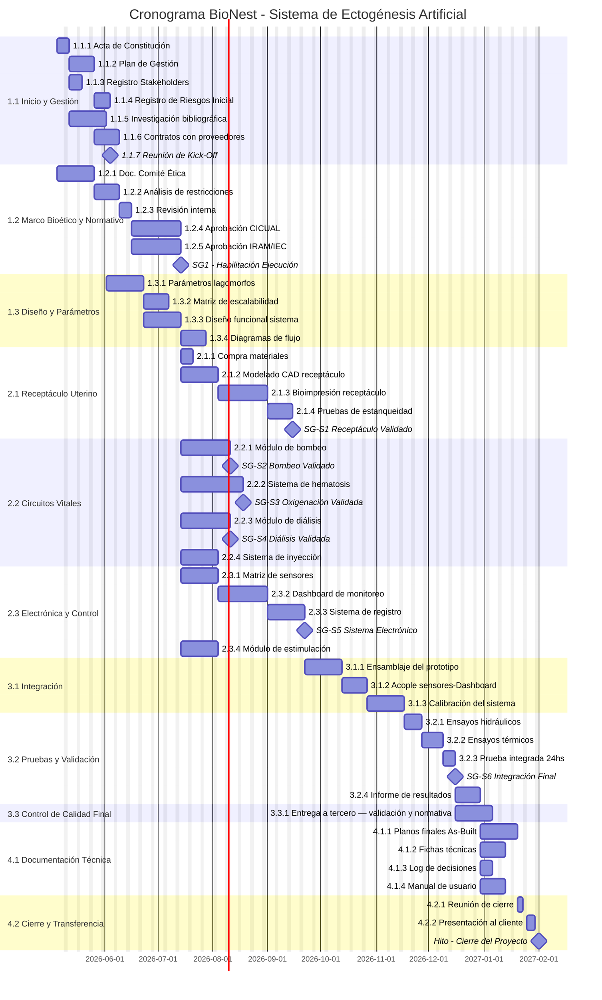

# 📅 Cronograma del Proyecto

## Diagrama de Gantt

## Tabla de tareas

| **ID** | **Tarea** | **Predecesoras** | **Responsable** | **Duración (días)** | **Inicio Estimado** | **Hito** |
|--------|-----------|-----------------|-----------------|:-------------------:|--------------------:|:--------:|
| | **FASE 1 — PLANIFICACIÓN PREDICTIVA** | | | | | |
| 1.1.1 | Acta de Constitución | — | Director de Proyecto | 5 | may-26 | No |
| 1.1.2 | Plan de Gestión del Proyecto | 1.1.1 | Director de Proyecto | 10 | may-26 | No |
| 1.1.3 | Registro de Stakeholders | 1.1.1 | Director de Proyecto | 5 | may-26 | No |
| 1.1.4 | Registro de Riesgos Inicial | 1.1.2 | Director de Proyecto | 7 | jun-26 | No |
| 1.1.5 | Investigación bibliográfica | 1.1.1 | Biotecnólogo | 15 | may-26 | No |
| 1.1.6 | Contratos con proveedores | 1.1.2 | Director de Proyecto | 10 | jun-26 | No |
| 1.1.7 | Reunión de Kick-Off | 1.1.4 | Director de Proyecto | 0 | jun-26 | **Sí** |
| 1.2.1 | Doc. Comité de Ética | 1.1.5 | Biotecnólogo | 15 | jun-26 | No |
| 1.2.2 | Análisis de restricciones | 1.2.1 | Biotecnólogo | 10 | jun-26 | No |
| 1.2.3 | Revisión interna | 1.2.2 | Director / Biotecnólogo | 5 | jul-26 | No |
| 1.2.4 | Aprobación CICUAL | 1.2.3 | Director de Proyecto | 20 | jul-26 | No |
| 1.2.5 | Aprobación IRAM/IEC | 1.2.3 | Bioingeniero | 20 | jul-26 | No |
| **SG1** | 🏁 **Stage-Gate 1 — Habilitación de Ejecución** | 1.2.4, 1.2.5 | — | 0 | ago-26 | **Sí** |
| 1.3.1 | Parámetros fisiológicos lagomorfos | 1.1.5 | Biotecnólogo | 15 | jun-26 | No |
| 1.3.2 | Matriz de escalabilidad | 1.3.1 | Biotecnólogo | 10 | jun-26 | No |
| 1.3.3 | Diseño funcional del sistema | 1.3.1 | Bioingeniero / Diseño Industrial | 15 | jul-26 | No |
| 1.3.4 | Diagramas de flujo | 1.3.3 | Bioingeniero | 10 | jul-26 | No |
| | **FASE 2 — EJECUCIÓN ADAPTATIVA (Kanban)** | | | | | |
| 2.1.1 | Compra de materiales a proveedores | SG1 | Esp. Materiales | 5 | ago-26 | No |
| 2.1.2 | Modelado CAD receptáculo | SG1 | Lic. Diseño Industrial | 15 | ago-26 | No |
| 2.1.3 | Bioimpresión receptáculo | 2.1.2 | Esp. Materiales | 20 | sep-26 | No |
| 2.1.4 | Pruebas de estanqueidad | 2.1.3 | Técnico de Laboratorio | 10 | oct-26 | No |
| **SG-S1** | 🏁 **Stage-Gate S1 — Receptáculo Validado** | 2.1.4 | — | 0 | oct-26 | **Sí** |
| 2.2.1 | Módulo de bombeo | SG1 | Bioingeniero | 20 | ago-26 | No |
| **SG-S2** | 🏁 **Stage-Gate S2 — Bombeo Validado** | 2.2.1 | — | 0 | sep-26 | **Sí** |
| 2.2.2 | Sistema de hematosis | SG1 | Bioingeniero / Biotecnólogo | 25 | ago-26 | No |
| **SG-S3** | 🏁 **Stage-Gate S3 — Oxigenación Validada** | 2.2.2 | — | 0 | sep-26 | **Sí** |
| 2.2.3 | Módulo de diálisis | SG1 | Bioingeniero / Biotecnólogo | 20 | ago-26 | No |
| **SG-S4** | 🏁 **Stage-Gate S4 — Diálisis Validada** | 2.2.3 | — | 0 | sep-26 | **Sí** |
| 2.2.4 | Sistema de inyección | SG1 | Bioingeniero | 15 | ago-26 | No |
| 2.3.1 | Matriz de sensores | SG1 | Bioingeniero | 15 | ago-26 | No |
| 2.3.2 | Dashboard de monitoreo | 2.3.1 | Desarrollador de Software | 20 | sep-26 | No |
| 2.3.3 | Sistema de registro de datos | 2.3.2 | Desarrollador de Software | 15 | oct-26 | No |
| 2.3.4 | Módulo de estimulación | SG1 | Bioingeniero | 15 | ago-26 | No |
| **SG-S5** | 🏁 **Stage-Gate S5 — Sistema Electrónico Validado** | 2.3.3 | — | 0 | nov-26 | **Sí** |
| | **FASE 3 — INTEGRACIÓN Y VALIDACIÓN FINAL** | | | | | |
| 3.1.1 | Ensamblaje del prototipo completo | SG-S1, SG-S2, SG-S3, SG-S4, SG-S5 | Equipo completo | 15 | nov-26 | No |
| 3.1.2 | Acople sensores–Dashboard | 3.1.1 | Bioingeniero / Desarrollador | 10 | dic-26 | No |
| 3.1.3 | Calibración del sistema | 3.1.2 | Biotecnólogo / Bioingeniero | 15 | dic-26 | No |
| 3.2.1 | Ensayos hidráulicos integrados | 3.1.3 | Técnico de Laboratorio | 8 | ene-27 | No |
| 3.2.2 | Ensayos térmicos integrados | 3.2.1 | Técnico de Laboratorio | 8 | ene-27 | No |
| 3.2.3 | Prueba integrada 24hs | 3.2.2 | Técnico de Laboratorio | 5 | feb-27 | No |
| **SG-S6** | 🏁 **Stage-Gate S6 — Integración Final** | 3.2.3 | — | 0 | feb-27 | **Sí** |
| 3.2.4 | Informe final de resultados | SG-S6 | Biotecnólogo / Director | 10 | feb-27 | No |
| 3.3.1 | Entrega a tercero — validación y normativa | SG-S6 | Director de Proyecto | 15 | mar-27 | No |
| | **FASE 4 — CIERRE Y TRANSFERENCIA** | | | | | |
| 4.1.1 | Planos finales As-Built | 3.2.4 | Lic. Diseño Industrial | 15 | mar-27 | No |
| 4.1.2 | Fichas técnicas | 3.2.4 | Esp. Materiales / Bioingeniero | 10 | mar-27 | No |
| 4.1.3 | Log de decisiones | 3.2.4 | Director de Proyecto | 5 | mar-27 | No |
| 4.1.4 | Manual de usuario | 3.2.4 | Biotecnólogo / Bioingeniero | 10 | mar-27 | No |
| 4.2.1 | Reunión de cierre | 3.3.1, 4.1.1, 4.1.2, 4.1.3, 4.1.4 | Director de Proyecto | 3 | abr-27 | No |
| 4.2.2 | Presentación al cliente | 4.2.1 | Director / Resp. Marketing | 5 | abr-27 | No |
| **MFIN** | 🏁 **Cierre del Proyecto** | 4.2.2 | — | 0 | abr-27 | **Sí** |

---

*Cátedra Gestión de Proyectos · FIUNER · 2026*
