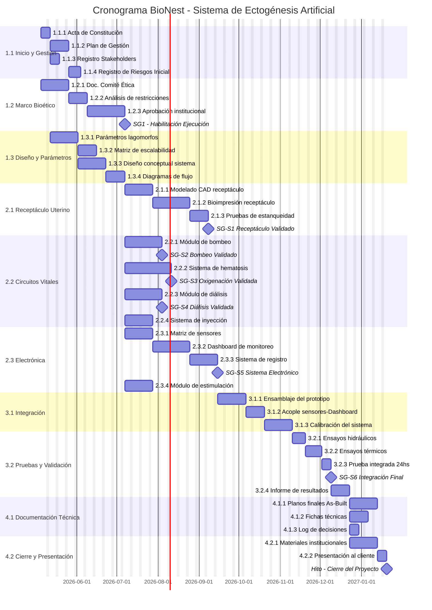

# 📅 Cronograma del Proyecto

## Diagrama de Gantt

## Tabla de tareas

| **ID**   | **Tarea**                                             | **Predecesoras** | **Responsable**      | **Duración (días)** | **Inicio Estimado** | **Hito** |
| -------- | ----------------------------------------------------- | ---------------- | -------------------- | ------------------- | ------------------- | -------- |
|          | **FASE 1: INVESTIGACIÓN Y PLANIFICACIÓN (3.5 meses)** |                  |                      |                     |                     |          |
| 1.1.5    | Investigación bibliográfica                           | 1.1.1            | Biotecnólogo         | 20                  | may-26              | No       |
| 1.2.1    | Doc. Comité Ética                                     | 1.1.5            | Biotecnólogo         | 15                  | jun-26              | No       |
| 1.2.3    | Aprobación institucional                              | 1.2.2            | Director             | 30                  | jul-26              | No       |
| 1.3.1    | Investigación parámetros                              | 1.1.5            | Biotecnólogo         | 25                  | jun-26              | No       |
| 1.3.3    | Diseño conceptual                                     | 1.3.2            | Bioingeniero         | 20                  | jul-26              | No       |
| M1       | 🏁 SG1 - Habilitación                                 | 1.2.3, 1.3.4     | —                    | 0                   | ago-26              | Sí       |
|          | **FASE 2A: MATERIALES (2 meses)**                     |                  |                      |                     |                     |          |
| 2.0.1    | Investigación biomateriales                           | M1               | Esp. Materiales      | 30                  | sep-26              | No       |
| 2.0.2    | Pruebas biocompatibilidad                             | 2.0.1            | Esp. Materiales      | 20                  | oct-26              | No       |
|          | **FASE 2B: RECEPTÁCULO (3.5 meses - 2 iteraciones)**  |                  |                      |                     |                     |          |
| 2.1.2    | Bioimpresión prototipo v1                             | 2.1.1            | Esp. Materiales      | 12                  | nov-26              | No       |
| 2.1.3    | Pruebas estanqueidad v1                               | 2.1.2            | Técnico              | 8                   | nov-26              | No       |
| 2.1.4    | Rediseño v2                                           | 2.1.3            | Diseñador Industrial | 10                  | dic-26              | No       |
| 2.1.5    | Bioimpresión prototipo v2                             | 2.1.4            | Esp. Materiales      | 12                  | dic-26              | No       |
| 2.1.6    | Pruebas estanqueidad v2                               | 2.1.5            | Técnico              | 8                   | ene-27              | No       |
| MS1      | 🏁 SG-S1 Receptáculo                                  | 2.1.7            | —                    | 0                   | ene-27              | Sí       |
|          | **FASE 2C: CIRCUITOS (5 meses)**                      |                  |                      |                     |                     |          |
| 2.2.1-5  | Módulo bombeo (2 iteraciones)                         | M1               | Bioingeniero         | 72                  | sep-dic 26          | No       |
| MS2      | 🏁 SG-S2 Bombeo                                       | 2.2.6            | —                    | 0                   | dic-26              | Sí       |
| 2.2.7    | Investigación hematosis                               | MS2              | Biotecnólogo         | 25                  | ene-27              | No       |
| 2.2.8-10 | Diseño y fab. oxigenador                              | 2.2.7            | Bioingeniero         | 35                  | ene-feb 27          | No       |
| 2.2.11   | Calibración parámetros                                | 2.2.10           | Biotecnólogo         | 10                  | feb-27              | No       |
| MS3      | 🏁 SG-S3 Oxigenación                                  | 2.2.11           | —                    | 0                   | mar-27              | Sí       |
|          | **FASE 2D: ELECTRÓNICA (4 meses)**                    |                  |                      |                     |                     |          |
| 2.4.1    | Investigación sensores                                | M1               | Bioingeniero         | 15                  | sep-26              | No       |
| 2.4.6-8  | Dashboard v1 y v2                                     | 2.4.1            | Desarrollador        | 50                  | oct-dic 26          | No       |
| 2.4.10   | Validación electrónica                                | 2.4.9            | Bioingeniero         | 8                   | ene-27              | No       |
| MS5      | 🏁 SG-S5 Electrónica                                  | 2.4.10           | —                    | 0                   | ene-27              | Sí       |
|          | **FASE 3: INTEGRACIÓN (4 meses)**                     |                  |                      |                     |                     |          |
| 3.1.2    | Ensamblaje prototipo                                  | MS1, MS5         | Equipo completo      | 15                  | feb-27              | No       |
| 3.1.4    | Calibración sistema completo                          | 3.1.3            | Biotecnólogo         | 15                  | mar-27              | No       |
| 3.1.5    | Resolución problemas                                  | 3.1.4            | Equipo completo      | 20                  | mar-27              | No       |
| 3.2.3    | Prueba integrada 24hs v1                              | 3.2.1, 3.2.2     | Técnico              | 2                   | abr-27              | No       |
| 3.2.4    | Ajustes post-prueba                                   | 3.2.3            | Equipo               | 10                  | abr-27              | No       |
| 3.2.5    | Prueba integrada 48hs v2                              | 3.2.4            | Técnico              | 3                   | may-27              | No       |
| MS6      | 🏁 SG-S6 Integración                                  | 3.2.6            | —                    | 0                   | may-27              | Sí       |
|          | **FASE 4: CIERRE (2.5 meses)**                        |                  |                      |                     |                     |          |
| 4.1.4    | Documentación científica                              | 3.2.7            | Biotecnólogo         | 20                  | jun-27              | No       |
| 4.2.2    | Video demostración                                    | 4.2.1            | Marketing            | 10                  | jul-27              | No       |
| 4.2.3    | Presentación cliente                                  | 4.2.2            | Director             | 2                   | ago-27              | No       |
| MFIN     | 🏁 Cierre Proyecto                                    | 4.2.3            | —                    | 0                   | ago-27              | Sí       |

---

*Cátedra Gestión de Proyectos · FIUNER · 2026*
