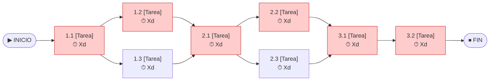

# 🔗 Red de Tareas y Camino Crítico

## Diagrama de precedencias

> Las tareas del **Camino Crítico** se muestran en rojo (holgura = 0).

## Análisis del Camino Crítico

| ID | Tarea | Inicio Temprano | Fin Temprano | Inicio Tardío | Fin Tardío | Holgura | ¿Crítica? |
|----|-------|:-:|:-:|:-:|:-:|:-:|:-:|
| 1.1 | [COMPLETAR] | [COMPLETAR] | [COMPLETAR] | [COMPLETAR] | [COMPLETAR] | 0 | ✅ |
| 1.2 | [COMPLETAR] | [COMPLETAR] | [COMPLETAR] | [COMPLETAR] | [COMPLETAR] | 0 | ✅ |
| 1.3 | [COMPLETAR] | [COMPLETAR] | [COMPLETAR] | [COMPLETAR] | [COMPLETAR] | [X] | ❌ |
| 2.1 | [COMPLETAR] | [COMPLETAR] | [COMPLETAR] | [COMPLETAR] | [COMPLETAR] | 0 | ✅ |
| 2.2 | [COMPLETAR] | [COMPLETAR] | [COMPLETAR] | [COMPLETAR] | [COMPLETAR] | 0 | ✅ |
| 2.3 | [COMPLETAR] | [COMPLETAR] | [COMPLETAR] | [COMPLETAR] | [COMPLETAR] | [X] | ❌ |

**Duración total del proyecto:** [COMPLETAR] días

**Camino Crítico:** `INICIO → 1.1 → 1.2 → 2.1 → 2.2 → 3.1 → 3.2 → FIN`

---

*Cátedra Gestión de Proyectos · FIUNER · 2026*
