# 🔗 Red de Tareas y Camino Crítico

## Diagrama de precedencias

> Las tareas del **Camino Crítico** se muestran en rojo (holgura = 0).

```mermaid
flowchart LR
    START(["▶ INICIO"])

    T111["1.1.1 Acta Constitución\n⏱ 3d"]
    T121["1.2.1 Doc Comité Ética\n⏱ 7d"]
    T122["1.2.2 Análisis restricciones\n⏱ 3d"]
    T123["1.2.3 Aprobación institucional\n⏱ 5d"]

    T131["1.3.1 Parámetros lagomorfos\n⏱ 5d"]
    T132["1.3.2 Matriz escalabilidad\n⏱ 4d"]

    T212["2.1.2 Bioimpresión\n⏱ 8d"]

    T231["2.3.1 Matriz sensores\n⏱ 8d"]
    T232["2.3.2 Dashboard software\n⏱ 10d"]
    T233["2.3.3 Registro datos\n⏱ 4d"]

    T311["3.1.1 Ensamblaje\n⏱ 5d"]
    T312["3.1.2 Acople sensores\n⏱ 3d"]
    T313["3.1.3 Calibración\n⏱ 4d"]

    T321["3.2.1 Ensayos hidráulicos\n⏱ 3d"]
    T323["3.2.3 Prueba 24hs\n⏱ 2d"]

    T421["4.2.1 Materiales marketing\n⏱ 5d"]
    T422["4.2.2 Presentación cliente\n⏱ 1d"]

    END(["⏹ FIN"])

    %% Secuencia principal (camino crítico)
    START --> T111 --> T121 --> T122 --> T123 --> T231 --> T232 --> T233 --> T311 --> T312 --> T313 --> T321 --> T323 --> T421 --> T422 --> END

    %% Ramas paralelas
    T111 --> T131 --> T132 --> T231
    T123 --> T212 --> T311

    %% Estilo camino crítico
    style T111 fill:#FFCCCC,stroke:#C62828
    style T121 fill:#FFCCCC,stroke:#C62828
    style T122 fill:#FFCCCC,stroke:#C62828
    style T123 fill:#FFCCCC,stroke:#C62828
    style T231 fill:#FFCCCC,stroke:#C62828
    style T232 fill:#FFCCCC,stroke:#C62828
    style T233 fill:#FFCCCC,stroke:#C62828
    style T311 fill:#FFCCCC,stroke:#C62828
    style T312 fill:#FFCCCC,stroke:#C62828
    style T313 fill:#FFCCCC,stroke:#C62828
    style T321 fill:#FFCCCC,stroke:#C62828
    style T323 fill:#FFCCCC,stroke:#C62828
    style T421 fill:#FFCCCC,stroke:#C62828
    style T422 fill:#FFCCCC,stroke:#C62828
```

## Análisis del Camino Crítico

| ID   | Tarea                     | Inicio Temprano | Fin Temprano | Inicio Tardío | Fin Tardío | Holgura | ¿Crítica? |
|------|--------------------------|-----------------|--------------|---------------|------------|---------|-----------|
| 1.1.1 | Acta Constitución        | 0               | 3            | 0             | 3          | 0       | ✅        |
| 1.2.1 | Doc Comité Ética         | 3               | 10           | 3             | 10         | 0       | ✅        |
| 1.2.2 | Análisis restricciones   | 10              | 13           | 10            | 13         | 0       | ✅        |
| 1.2.3 | Aprobación institucional | 13              | 18           | 13            | 18         | 0       | ✅        |
| 1.3.1 | Parámetros lagomorfos    | 3               | 8            | 6             | 11         | 3       | ❌        |
| 1.3.2 | Matriz escalabilidad     | 8               | 12           | 11            | 15         | 3       | ❌        |
| 2.1.2 | Bioimpresión             | 24              | 32           | 27            | 35         | 3       | ❌        |
| 2.3.1 | Matriz sensores          | 18              | 26           | 18            | 26         | 0       | ✅        |
| 2.3.2 | Dashboard software       | 26              | 36           | 26            | 36         | 0       | ✅        |
| 2.3.3 | Registro datos           | 36              | 40           | 36            | 40         | 0       | ✅        |
| 3.1.1 | Ensamblaje               | 40              | 45           | 40            | 45         | 0       | ✅        |
| 3.1.2 | Acople sensores          | 45              | 48           | 45            | 48         | 0       | ✅        |
| 3.1.3 | Calibración              | 48              | 52           | 48            | 52         | 0       | ✅        |
| 3.2.1 | Ensayos hidráulicos      | 52              | 55           | 52            | 55         | 0       | ✅        |
| 3.2.3 | Prueba 24hs              | 55              | 57           | 55            | 57         | 0       | ✅        |
| 4.2.1 | Materiales marketing     | 57              | 62           | 57            | 62         | 0       | ✅        |
| 4.2.2 | Presentación cliente     | 62              | 63           | 62            | 63         | 0       | ✅        |
**Duración total del proyecto:** [COMPLETAR] días

**Camino Crítico:** `INICIO → 1.1.1 Acta → 1.2.1 Doc Ética → 1.2.2 Análisis → 1.2.3 Aprobación → SG1 → 2.3.1 Sensores → 2.3.2 Dashboard → 2.3.3 Registro → SG-S5 → 3.1.1 Ensamblaje → 3.1.2 Acople → 3.1.3 Calibración → 3.2.1 Hidráulica → 3.2.3 Prueba 24h → SG-S6 → 4.2.1 Materiales → 4.2.2 Presentación → FIN`

---

*Cátedra Gestión de Proyectos · FIUNER · 2026*
