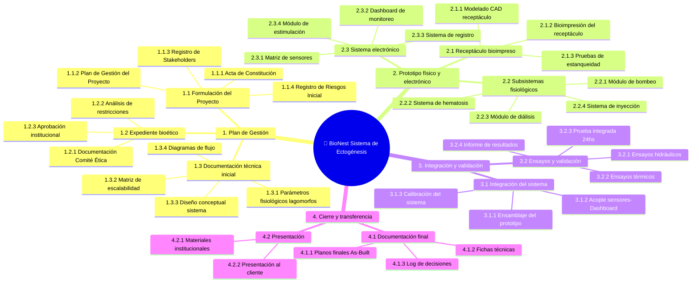

# 🌳 Work Breakdown Structure (WBS)

## Diagrama WBS

## Diccionario de la WBS
##  Estructura General

| Fase | ID | Nombre | Tipo |
|------|-----|--------|------|
| 1 | `1` | **PLANIFICACIÓN** | Fase |
| 2 | `2` | **EJECUCIÓN ADAPTATIVA — DESARROLLO DE SUBSISTEMAS (KANBAN)** | Fase |
| 3 | `3` | **INTEGRACIÓN Y VALIDACIÓN FINAL** | Fase |
| 4 | `4` | **CIERRE Y TRANSFERENCIA** | Fase |

---

##  Fase 1 — PLANIFICACIÓN

### 1.1 Gestión del Proyecto

| ID | Tarea | Entregable |
|----|-------|-----------|
| 1.1.1 | Acta de Constitución | Acta de Constitución |
| 1.1.2 | Plan de Gestión del Proyecto (Alcance + Cronograma) | Plan de Gestión |
| 1.1.3 | Registro y Estrategia de Stakeholders | Registro de Stakeholders |
| 1.1.4 | Registro de Riesgos Inicial | Registro de Riesgos |
| 1.1.5 | Diagramado de Presupuesto | Presupuesto Inicial |
| 1.1.6 | Contratos con proveedores (biomateriales, electrónica, insumos) | Contratos y Convenios |
| 1.1.7 | Reunión de Kick Off | Acta de Kick Off |

### 1.2 Expediente Bioético y Normativo

| ID | Tarea | Entregable |
|----|-------|-----------|
| 1.2.1 | Documentación para el Comité de Ética Institucional | Expediente Ético |
| 1.2.2 | Análisis de implicancias y restricciones de uso | Informe de Restricciones |
| 1.2.3 | Etapa de revisión | Informe de Revisión |
| 1.2.4 | Envío de documentación al organismo de ética | — |
| 1.2.5 | ⬧ **Obtención de aprobación ética CICUAL** *(HITO DE AVANCE — ~30–45 días calendario)* | Aprobación CICUAL |

### 1.3 Definición Técnica de Subsistemas

| ID | Tarea | Entregable |
|----|-------|-----------|
| 1.3.1 | Especificaciones de parámetros fisiológicos (Lagomorfos) | Documento de Parámetros |
| 1.3.2 | Matriz de escalabilidad | Matriz de Escalabilidad |
| 1.3.3 | Diseño funcional del sistema (arquitectura) | Diseño Funcional |
| 1.3.4 | Diagramas de flujo del sistema | Diagramas del Sistema |

---

##  Fase 2 — DESARROLLO DE SUBSISTEMAS *(Kanban)*

### 2.1 Receptáculo Uterino

| ID | Tarea | Entregable | Riesgo |
|----|-------|-----------|--------|
| 2.1.1 | Compra de materiales a proveedores *(tercerizada)* | Materiales Adquiridos | — |
| 2.1.2 | Modelado CAD del habitáculo uterino | Modelo CAD | — |
| 2.1.3 | ⚠ Bioimpresión con hidrogeles/biomateriales | Prototipo Bioimpreso | **ALTO** |
| 2.1.4 | Pruebas de estanqueidad y resistencia a presión | Informe de Ensayos | Medio |

### 2.2 Circuitos de Soporte Vital

| ID | Tarea | Entregable | Riesgo |
|----|-------|-----------|--------|
| 2.2.1 | Módulo de bombeo *(corazón artificial)* | Módulo de Bombeo | Medio |
| 2.2.2 | ⚠ Sistema de hematosis artificial *(oxigenación y descarboxilación)* | Sistema de Hematosis | **ALTO — tarea más compleja** |
| 2.2.3 | Módulo de filtrado y diálisis | Sistema de Filtrado | Medio |
| 2.2.4 | Sistema de inyección *(nutrientes/hormonas)* | Sistema de Inyección | Bajo |

### 2.3 Electrónica y Control

| ID | Tarea | Entregable | Riesgo |
|----|-------|-----------|--------|
| 2.3.1 | Integración de matriz de sensores (Presión · Temp · pH · Vol) | Matriz de Sensores | Medio |
| 2.3.2 | Desarrollo de la interfaz de usuario *(Dashboard)* | Dashboard Funcional | Medio |
| 2.3.3 | Sistema de almacenamiento y registro de datos experimentales | Base de Datos Experimental | Bajo |
| 2.3.4 | Módulo de estimulación | Módulo de Estimulación | Bajo |

---

##  Fase 3 — INTEGRACIÓN Y VALIDACIÓN FINAL

### 3.1 Integración Mecánica y Electrónica

| ID | Tarea | Entregable |
|----|-------|-----------|
| 3.1.1 | Ensamblaje del prototipo físico completo | Prototipo Ensamblado |
| 3.1.2 | Acoplamiento de sensores al Dashboard | Integración Sensores-Dashboard |
| 3.1.3 | Calibración del sistema completo | Sistema Calibrado |

### 3.2 Protocolo de Pruebas de Sistema

| ID | Tarea | Entregable |
|----|-------|-----------|
| 3.2.1 | Ensayos hidráulicos integrados | Informe Hidráulico |
| 3.2.2 | Ensayos térmicos integrados | Informe Térmico |
| 3.2.3 | Simulación de circulación continua *(Prueba 24hs)* | Informe de Simulación |
| 3.2.4 | Informe final de resultados y conclusiones | Informe Final |

### 3.3 Control de Calidad Final

| ID | Tarea | Entregable |
|----|-------|-----------|
| 3.3.1 | Entrega a tercero para validación final y aprobación normativa *(tercerizada)* | Validación Externa |

---

##  Fase 4 — CIERRE Y TRANSFERENCIA

### 4.1 Documentación Técnica "As-Built"

| ID | Tarea | Entregable |
|----|-------|-----------|
| 4.1.1 | Actualizar planos finales As-Built | Planos Finales |
| 4.1.2 | Elaborar fichas técnicas | Fichas Técnicas |
| 4.1.3 | Compilar log de decisiones | Registro de Decisiones |
| 4.1.4 | Redactar manual de usuario | Manual de Usuario |

### 4.2 Marketing y Licenciamiento

| ID | Tarea | Entregable |
|----|-------|-----------|
| 4.2.1 | Reunión de cierre | Acta de Cierre |
| 4.2.2 | Presentación final a la Institución de Conservación *(cliente)* | Presentación Final |

---

## Resumen por Fase

| Fase | Subgrupos | Tareas | TE Aprox. (hs) |
|------|-----------|--------|----------------|
| 1 — Planificación | 3 (1.1 / 1.2 / 1.3) | 15 + 1 hito | ~381 |
| 2 — Desarrollo | 3 (2.1 / 2.2 / 2.3) | 12 | ~730 |
| 3 — Integración | 3 (3.1 / 3.2 / 3.3) | 8 | ~334 |
| 4 — Cierre | 2 (4.1 / 4.2) | 6 | ~110 |
| **TOTAL** | **11** | **41 + 1 hito** | **~1554** |

---

*Cátedra Gestión de Proyectos · FIUNER · 2026*
