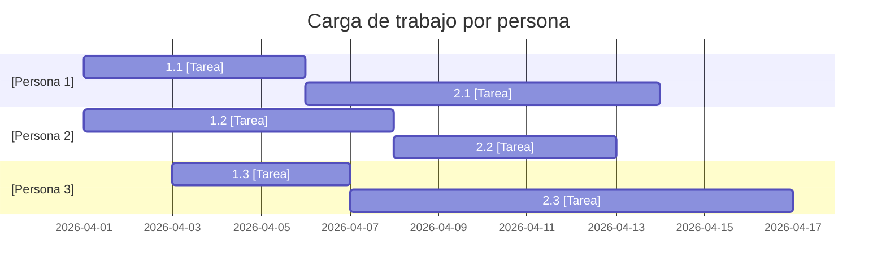

# ⚙️ Asignación de Recursos y Estimaciones Recalculadas

## Perfil de recursos

| Persona | Rol | Disponibilidad (hs/sem) | Dedicación al proyecto |
|---------|-----|:-----------------------:|:---------------------:|
| [COMPLETAR] | [COMPLETAR] | [COMPLETAR] | [COMPLETAR]% |
| [COMPLETAR] | [COMPLETAR] | [COMPLETAR] | [COMPLETAR]% |
| [COMPLETAR] | [COMPLETAR] | [COMPLETAR] | [COMPLETAR]% |

## Estimaciones recalculadas vs. Entrega 2

| ID | Tarea | Esfuerzo E2 (hs) | Persona asignada | Dedicación (%) | Duración E2 (días) | Duración E3 (días) | Δ Días | Justificación del cambio |
|----|-------|:----------------:|-----------------|:--------------:|:-----------------:|:-----------------:|:------:|--------------------------|
| 1.1 | [COMPLETAR] | [COMPLETAR] | [COMPLETAR] | [COMPLETAR]% | [COMPLETAR] | [COMPLETAR] | [COMPLETAR] | [COMPLETAR] |
| 1.2 | [COMPLETAR] | [COMPLETAR] | [COMPLETAR] | [COMPLETAR]% | [COMPLETAR] | [COMPLETAR] | [COMPLETAR] | [COMPLETAR] |
| 2.1 | [COMPLETAR] | [COMPLETAR] | [COMPLETAR] | [COMPLETAR]% | [COMPLETAR] | [COMPLETAR] | [COMPLETAR] | [COMPLETAR] |

## Detección de sobreasignaciones

### Sobreasignaciones detectadas

| Persona | Período conflictivo | Tareas en simultáneo | Carga total | Ajuste propuesto |
|---------|--------------------|-----------------------|:-----------:|-----------------|
| [COMPLETAR] | [COMPLETAR] | [COMPLETAR] | [COMPLETAR]% | [COMPLETAR] |

---

*Cátedra Gestión de Proyectos · FIUNER · 2026*
