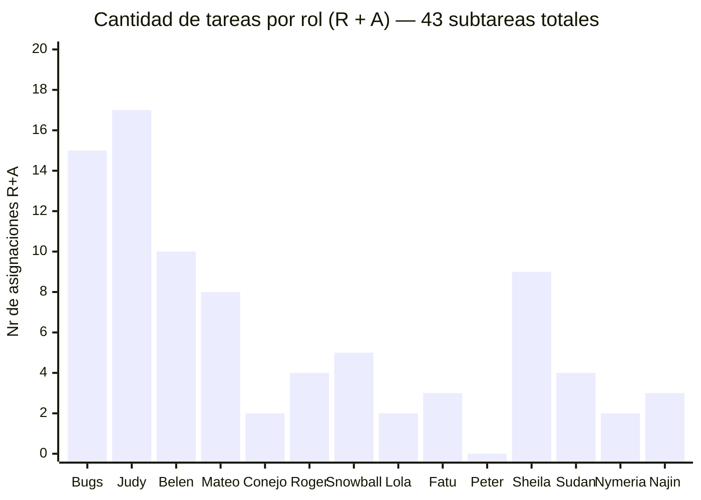

# 👥 Matriz RACI

> **R** = Responsable (ejecuta) · **A** = Aprobador (único por tarea) · **C** = Consultado · **I** = Informado

## Roles del proyecto

|N|Rol|Persona asignada|
|---|---|---|
|1|Director de Proyecto|Bugs Bunny|
|2|Jefe de Ingenieria|Judy Hopps|
|3|Bioingeniero 1|Belen Hornus|
|4|Bioingeniero 2|Mateo Anderson|
|5|Especialista en Materiales|Sr Conejo|
|6|Biotecnologo|Roger Rabbit|
|7|Tecnico de Laboratorio|Snowball|
|8|Desarrollador de Software|Lola Bunny|
|9|Disenador Industrial|Fatu|
|10|Responsable de Marketing|Peter Rabbit|
|11|Gestora de Calidad|Sheila Riffel|
|12|Sponsor|Sudan|
|13|Organismo Regulador|Nymeria Stark|
|14|Finanzas / Contador|Najin|

## Matriz
| ID      | Tarea                                                | Bugs | Judy | Belen | Mateo | Conejo | Roger | Snow | Lola | Fatu | Peter | Sheila | Najin | Sudan | Nymeria |
| ------- | ---------------------------------------------------- | ---- | ---- | ----- | ----- | ------ | ----- | ---- | ---- | ---- | ----- | ------ | ----- | ----- | ------- |
| **1.1** | **Gestión del proyecto**                             |      |      |       |       |        |       |      |      |      |       |        |       |       |         |
| 1.1.1   | Redactar acta de constitución                        | R    | -    | -     | -     | -      | -     | -    | -    | -    | I     | C      | I     | A     | -       |
| 1.1.2   | Plan de gestión del proyecto                         | R    | C    | -     | -     | -      | -     | -    | -    | -    | I     | A      | -     | -     | -       |
| 1.1.3   | Identificar stakeholders                             | R    | C    | -     | -     | -      | -     | -    | -    | -    | -     | A      | -     | -     | -       |
| 1.1.4   | Registro de riesgos inicial                          | R    | C    | I     | I     | I      | I     | I    | I    | I    | -     | A      | -     | -     | -       |
| 1.1.5   | Diagramar presupuesto                                | A    | I    | -     | -     | -      | -     | -    | -    | -    | -     | -      | R     | -     | -       |
| 1.1.6   | Gestionar contratos con proveedores                  | A    | I    | -     | -     | C      | -     | -    | -    | -    | I     | -      | R     | -     | -       |
| 1.1.7   | Reunión de Kick Off                                  | R    | -    | -     | -     | -      | -     | -    | -    | -    | -     | -      | -     | A     | -       |
| **1.2** | **Expediente bioético y normativo**                  |      |      |       |       |        |       |      |      |      |       |        |       |       |         |
| 1.2.1   | Realizar documentación comité de ética               | A    | -    | -     | -     | -      | R     | -    | -    | -    | -     | C      | -     | -     | -       |
| 1.2.2   | Analizar implicancias de uso                         | -    | I    | C     | C     | C      | R     | -    | -    | -    | -     | A      | -     | -     | -       |
| 1.2.3   | Revisar documentación institucional                  | A    | -    | -     | -     | -      | -     | -    | -    | -    | -     | R      | -     | -     | -       |
| 1.2.4   | Enviar documentación al organismo                    | R    | -    | -     | -     | -      | -     | -    | -    | -    | -     | A      | -     | -     | -       |
| 1.2.4b  | Aprobación seguridad eléctrica (IRAM/IEC)            | -    | -    | -     | -     | -      | -     | -    | -    | -    | -     | -      | -     | -     | A       |
| 1.2.5   | Aprobación ética CICUAL _(hito)_                     | -    | -    | -     | -     | -      | -     | -    | -    | -    | -     | -      | -     | -     | A       |
| **1.3** | **Definición técnica de subsistemas**                |      |      |       |       |        |       |      |      |      |       |        |       |       |         |
| 1.3.1   | Definir parámetros fisiológicos de referencia        | -    | A    | C     | C     | C      | R     | I    | -    | -    | -     | -      | -     | -     | -       |
| 1.3.2   | Elaborar matriz de escalabilidad                     | -    | A    | R     | I     | C      | -     | -    | -    | -    | -     | -      | -     | -     | -       |
| 1.3.3   | Diseñar arquitectura funcional                       | -    | A    | R     | I     | I      | -     | -    | I    | C    | -     | -      | -     | -     | -       |
| 1.3.4   | Elaborar diagramas de flujo del sistema (P&D)        | -    | I    | A     | C     | C      | -     | -    | -    | R    | -     | -      | -     | -     | -       |
| **2.1** | **Receptáculo uterino**                              |      |      |       |       |        |       |      |      |      |       |        |       |       |         |
| 2.1.1   | Comprar materiales tercerizados                      | A    | -    | -     | -     | C      | -     | -    | -    | -    | -     | C      | R     | -     | -       |
| 2.1.2   | Diseñar modelo CAD del habitáculo                    | -    | I    | A     | I     | I      | C     | -    | I    | R    | -     | I      | -     | -     | -       |
| 2.1.3   | Bioimprimir receptáculo (hidrogeles)                 | -    | I    | I     | I     | R      | A     | I    | I    | -    | -     | C      | -     | -     | -       |
| 2.1.4   | Pruebas de estanqueidad y presión                    | -    | I    | I     | A     | I      | I     | R    | -    | -    | -     | C      | -     | -     | -       |
| **2.2** | **Circuitos de soporte vital**                       |      |      |       |       |        |       |      |      |      |       |        |       |       |         |
| 2.2.1   | Diseñar módulo de bombeo                             | -    | A    | R     | C     | I      | -     | -    | -    | C    | -     | -      | -     | -     | -       |
| 2.2.2   | Diseñar sistema de hematosis artificial              | -    | A    | C     | R     | C      | -     | -    | -    | C    | -     | -      | -     | -     | -       |
| 2.2.3   | Diseñar módulo de filtrado y diálisis                | -    | A    | R     | C     | C      | -     | -    | -    | C    | -     | -      | -     | -     | -       |
| 2.2.4   | Diseñar sistema de inyección                         | -    | A    | C     | R     | C      | C     | -    | -    | C    | -     | -      | -     | -     | -       |
| **2.3** | **Electrónica y control**                            |      |      |       |       |        |       |      |      |      |       |        |       |       |         |
| 2.3.1   | Integrar matriz de sensores                          | -    | A    | C     | R     | -      | -     | I    | C    | -    | -     | -      | -     | -     | -       |
| 2.3.2   | Desarrollar dashboard                                | -    | A    | C     | C     | -      | -     | I    | R    | -    | -     | -      | -     | -     | -       |
| 2.3.3   | Desarrollar módulo de estimulación                   | -    | A    | R     | C     | C      | C     | I    | I    | C    | -     | -      | -     | -     | -       |
| 2.3.4   | Sistema de almacenamiento de datos                   | -    | A    | -     | -     | -      | -     | -    | R    | -    | -     | -      | -     | -     | -       |
| **3.1** | **Integración mecánica y electrónica**               |      |      |       |       |        |       |      |      |      |       |        |       |       |         |
| 3.1.1   | Ensamblar prototipo físico completo                  | -    | A    | C     | R     | -      | -     | I    | -    | C    | I     | -      | -     | -     | -       |
| 3.1.2   | Integrar sensores al dashboard                       | -    | A    | R     | C     | -      | -     | I    | C    | -    | -     | -      | -     | -     | -       |
| 3.1.3   | Calibrar parámetros fisiológicos                     | -    | A    | C     | R     | C      | C     | I    | -    | -    | -     | C      | -     | -     | -       |
| **3.2** | **Protocolo de pruebas de sistema**                  |      |      |       |       |        |       |      |      |      |       |        |       |       |         |
| 3.2.1   | Ensayos hidráulicos integrados                       | -    | I    | A     | C     | -      | -     | R    | -    | -    | -     | -      | -     | -     | -       |
| 3.2.2   | Ensayos térmicos integrados                          | -    | I    | C     | A     | -      | -     | R    | -    | -    | -     | -      | -     | -     | -       |
| 3.2.3   | Simulación de circulación continua (24 hs)           | -    | I    | A     | C     | -      | -     | R    | -    | -    | -     | I      | -     | -     | -       |
| 3.2.4   | Informe final de resultados                          | I    | I    | I     | A     | I      | I     | R    | -    | -    | -     | I      | -     | -     | -       |
| 3.2.5   | Gestionar validación externa para control de calidad | R    | -    | -     | -     | -      | -     | -    | -    | -    | -     | A      | C     | -     | -       |
| **4.1** | **Documentación técnica "as-built"**                 |      |      |       |       |        |       |      |      |      |       |        |       |       |         |
| 4.1.1   | Actualizar planos finales                            | I    | A    | C     | C     | -      | -     | -    | -    | R    | -     | C      | -     | -     | -       |
| 4.1.2   | Elaborar fichas técnicas                             | I    | A    | C     | C     | R      | -     | C    | C    | -    | -     | C      | -     | -     | -       |
| 4.1.3   | Consolidar log de decisiones                         | R    | C    | C     | C     | C      | -     | -    | C    | C    | -     | A      | -     | -     | -       |
| 4.1.4   | Elaborar manual de usuario                           | C    | R    | C     | C     | -      | -     | -    | C    | -    | -     | A      | -     | -     | -       |
| **4.2** | **Marketing y licenciamiento**                       |      |      |       |       |        |       |      |      |      |       |        |       |       |         |
| 4.2.1   | Reunión de cierre                                    | R    | -    | -     | -     | -      | -     | -    | -    | -    | -     | -      | -     | A     | -       |
| 4.2.2   | Presentación final a la institución                  | R    | -    | -     | -     | -      | -     | -     | -     |-      |-       | -       |  -     |  A     |    -     |

### Detalle por persona

|Persona|Rol|R|A|Total R+A|Tareas donde es R|Tareas donde es A|
|---|---|:-:|:-:|:-:|---|---|
|Judy Hopps|Jefe de Ingenieria|1|16|**17**|4.1.4|1.3.1, 1.3.2, 1.3.3, 2.2.1, 2.2.2, 2.2.3, 2.2.4, 2.3.1, 2.3.2, 2.3.3, 2.3.4, 3.1.1, 3.1.2, 3.1.3, 4.1.1, 4.1.2|
|Bugs Bunny|Director de Proyecto|10|5|**15**|1.1.1, 1.1.2, 1.1.3, 1.1.4, 1.1.7, 1.2.4, 3.2.5, 4.1.3, 4.2.1, 4.2.2|1.1.5, 1.1.6, 1.2.1, 1.2.3, 2.1.1|
|Belen Hornus|Bioingeniero 1|6|4|**10**|1.3.2, 1.3.3, 2.2.1, 2.2.3, 2.3.3, 3.1.2|1.3.4, 2.1.2, 3.2.1, 3.2.3|
|Sheila Riffel|Gestora de Calidad|1|8|**9**|1.2.3|1.1.2, 1.1.3, 1.1.4, 1.2.2, 1.2.4, 3.2.5, 4.1.3, 4.1.4|
|Mateo Anderson|Bioingeniero 2|5|3|**8**|2.2.2, 2.2.4, 2.3.1, 3.1.1, 3.1.3|2.1.4, 3.2.2, 3.2.4|
|Snowball|Tecnico de Laboratorio|5|0|**5**|2.1.4, 3.2.1, 3.2.2, 3.2.3, 3.2.4|—|
|Sudan|Sponsor|0|4|**4**|—|1.1.1, 1.1.7, 4.2.1, 4.2.2|
|Roger Rabbit|Biotecnologo|3|1|**4**|1.2.1, 1.2.2, 1.3.1|2.1.3|
|Najin|Finanzas / Contador|3|0|**3**|1.1.5, 1.1.6, 2.1.1|—|
|Fatu|Disenador Industrial|3|0|**3**|1.3.4, 2.1.2, 4.1.1|—|
|Sr Conejo|Especialista en Materiales|2|0|**2**|2.1.3, 4.1.2|—|
|Lola Bunny|Desarrollador de Software|2|0|**2**|2.3.2, 2.3.4|—|
|Nymeria Stark|Organismo Regulador|0|2|**2**|—|1.2.4b, 1.2.5|
|Peter Rabbit|Responsable de Marketing|0|0|**0**|—|—|

> Verificacion: las 43 subtareas tienen exactamente 1 A cada una (43 A distribuidos). Las subtareas 1.2.4b y 1.2.5 son hitos de aprobacion externa: tienen A (Nymeria Stark) pero no tienen R interno, ya que son resoluciones del organismo regulador.

## Análisis de carga de responsabilidades

## Analisis de sobrecarga
> La distribución presenta dos roles con carga crítica: Judy Hopps (Jefe de Ingeniería, 17 asignaciones) concentra el 40% de todos los A del proyecto, actuando como aprobadora única en toda la fase de diseño de subsistemas (2.2.x, 2.3.x) e integración (3.1.x). Bugs Bunny (Director, 15 asignaciones) distribuye su carga entre gestión inicial, trámite normativo y cierre, sin superponerse con la ejecución técnica, lo que es coherente con el rol. Estos dos roles son el cuello de botella de aprobación del proyecto.
> En el extremo opuesto, Peter Rabbit (Marketing) acumula 0 R y 0 A sobre las 43 subtareas. Su participación formal se limita a roles de I y C. Dado que las tareas 4.2.1 y 4.2.2 corresponden directamente a su área, se recomienda asignarle R en al menos una de ellas. Los roles de Lola Bunny (Software, 2) y Sr Conejo (Materiales, 2) tienen cargas bajas pero justificadas: su participación es técnicamente específica y acotada a los subsistemas donde son especialistas.
> El equilibrio se mantiene aceptable para un equipo académico de esta escala bajo dos condiciones: que Judy Hopps cuente con un respaldo técnico identificado para sus 16 A en caso de ausencia, y que el tablero Kanban limite el WIP activo a 2 cards simultáneas en Diseño/Fabricación para que ningún aprobador deba resolver más de 2 validaciones en paralelo. 

---

*Cátedra Gestión de Proyectos · FIUNER · 2026*
