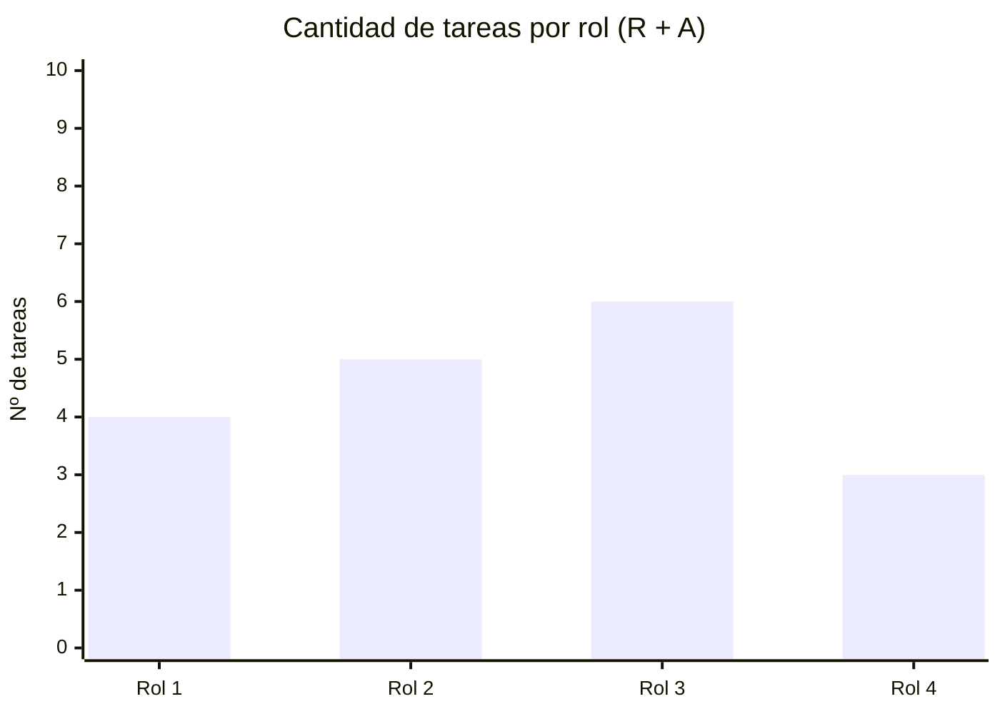

# 👥 Matriz RACI

> **R** = Responsable (ejecuta) · **A** = Aprobador (único por tarea) · **C** = Consultado · **I** = Informado

## Roles del proyecto

| Rol | Persona asignada |
|-----|-----------------|
| [Rol 1 — ej: Director de Proyecto] | [COMPLETAR] |
| [Rol 2 — ej: Analista] | [COMPLETAR] |
| [Rol 3 — ej: Desarrollador] | [COMPLETAR] |
| [Rol 4 — ej: Tester] | [COMPLETAR] |

## Matriz

| ID | Tarea | [Rol 1] | [Rol 2] | [Rol 3] | [Rol 4] |
|----|-------|:-------:|:-------:|:-------:|:-------:|
| 1.1 | [COMPLETAR] | A | R | I | I |
| 1.2 | [COMPLETAR] | A | R | C | I |
| 1.3 | [COMPLETAR] | A | C | R | I |
| 2.1 | [COMPLETAR] | A | R | R | I |
| 2.2 | [COMPLETAR] | A | C | R | C |
| 2.3 | [COMPLETAR] | A | I | R | R |
| 3.1 | [COMPLETAR] | A | C | R | R |
| 3.2 | [COMPLETAR] | A | I | C | R |

> ⚠️ **Verificación obligatoria:** cada fila debe tener exactamente **1 A** y al menos **1 R**.

## Análisis de carga de responsabilidades

> [COMPLETAR: analizar si hay roles sobrecargados o con pocas responsabilidades y cómo se equilibra]

---

*Cátedra Gestión de Proyectos · FIUNER · 2026*
