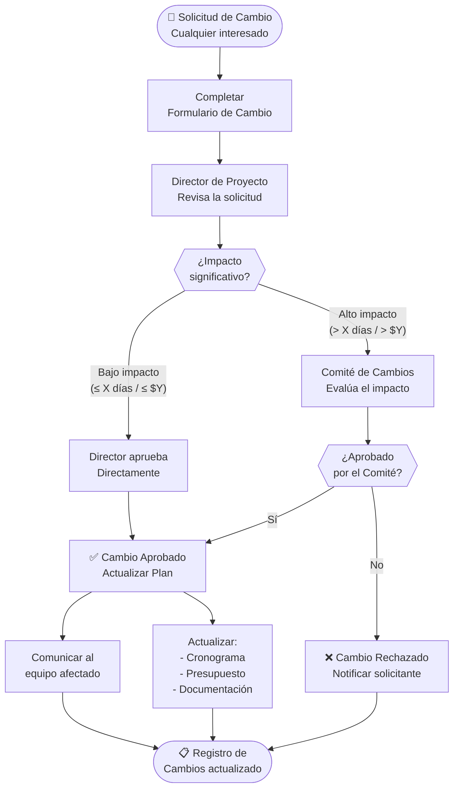

# 🔄 Gestión de Cambios

## Circuito de cambios

## Roles en la gestión de cambios

| Rol | Persona | Responsabilidad |
|-----|---------|----------------|
| Solicitante | Cualquier interesado | Completar el formulario de cambio |
| Evaluador inicial | [COMPLETAR — Director de Proyecto] | Analizar impacto y urgencia |
| Comité de Cambios | [COMPLETAR] | Aprobar cambios de alto impacto |
| Implementador | [COMPLETAR] | Ejecutar el cambio aprobado |

## Criterios de aprobación

| Criterio | Aprobación directa (Director) | Requiere Comité |
|----------|:-----------------------------:|:---------------:|
| Impacto en cronograma | ≤ [X] días | > [X] días |
| Impacto en presupuesto | ≤ $[Y] | > $[Y] |
| Cambio en alcance | No afecta entregables | Afecta entregables |
| Urgencia | Normal | Crítico |

## Registro de cambios

> Ver plantilla: [`/plantillas/formulario-cambio.md`](../../plantillas/formulario-cambio.md)

| # | Fecha | Descripción del cambio | Solicitante | Estado | Impacto |
|---|-------|------------------------|------------|:------:|---------|
| CC-001 | [COMPLETAR] | [COMPLETAR] | [COMPLETAR] | ✅ Aprobado | [COMPLETAR] |

---

*Cátedra Gestión de Proyectos · FIUNER · 2026*
